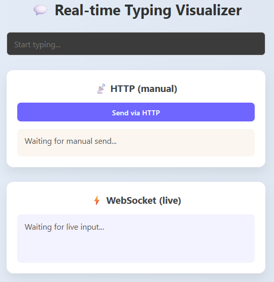

# 💬 Real-time Typing Visualizer with WebSockets

<p align="center">
  
</p>

## Table of Contents

- [📝 Overview](#-overview)
- [🧩 What Are WebSockets?](#-what-are-websockets)
- [⚡ HTTP vs WebSocket](#-http-vs-websocket)
- [📖 Project Overview](#-project-overview)
- [🚀 Running Locally](#-running-locally)
- [🐳 Running with Docker](#-running-with-docker)
- [🛠 Project Structure](#-project-structure)
- [🔗 References](#-references)

## 📝 Overview

This project demonstrates **real-time typing visualization** using both **HTTP** and **WebSocket** communication.

- **HTTP Panel (manual)**:dates message manually via a button.
- **WebSocket Panel (live)**: Updates live as you type, showing server-processed transformations.

It’s a simple, beginner-friendly project to understand the difference between **HTTP polling** and **WebSocket connections**.

## 🧩 What Are WebSockets?

Imagine you’re chatting with a friend — you send a message, and your friend replies instantly.
That’s exactly how **WebSockets** work between a browser (client) and a server.

Normally, with HTTP, your browser has to **ask repeatedly** (“Any updates?”).
With WebSockets, once connected, the **server can send updates anytime** without being asked.

### Simple Example

Think of a “doorbell” analogy:

- **HTTP**: You keep knocking on the door again and again to check if the pizza arrived 🍕.
- **WebSockets**: You ring once, and the delivery person can ring **your bell anytime** when pizza is ready 🔔.

### Key Features of WebSockets

1. **Full-duplex communication**: Both client and server can send data independently.
2. **Persistent connection**: The connection stays open, reducing overhead.
3. **Low latency**: Ideal for real-time applications.
4. **Use cases**: Chats, gaming, live dashboards, IoT, notifications, stock tickers.

### WebSocket vs HTTP

| Feature     | HTTP                            | WebSocket                    |
| ----------- | ------------------------------- | ---------------------------- |
| Connection  | Short-lived, request-response   | Long-lived, bidirectional    |
| Latency     | Higher (polling needed)         | Low (instant updates)        |
| Server Push | No                              | Yes                          |
| Use case    | Static content, form submission | Real-time apps, live updates |

## 🚀 How This Project Works

- **Backend**: FastAPI serves HTTP endpoints and a WebSocket endpoint.
- **Frontend**: React app with two panels:

  - HTTP panel updates messages manually.
  - WebSocket panel updates live with a small transformation (reverses typed text and adds emojis).

- **WebSocket demonstration**: Shows that messages originate from the backend (check console logs).

## 🛠 Running Locally

1. **Clone the repository**

```bash
git clone <repo-url>
cd typing-visualizer
```

2. **Start Backend**

```bash
cd backend
python -m venv venv
source venv/bin/activate  # Linux/Mac
venv\Scripts\activate     # Windows
pip install -r requirements.txt
python -m uvicorn main:app --reload --host 0.0.0.0 --port 8000
```

3. **Start Frontend**

```bash
cd frontend
npm install
npm run dev
```

4. Open browser at [http://localhost:5173](http://localhost:5173)

## 🐳 Running with Docker

1. **Build and run with Docker Compose**

```bash
docker-compose up --build
```

2. Frontend available at `http://localhost:5173` and backend at `http://localhost:8000`.

> Note: In Docker, the frontend can access the backend via service name `backend:8000` for WebSocket connections inside the container network.

## 📚 References for WebSockets

- [MDN Web Docs - WebSockets](https://developer.mozilla.org/en-US/docs/Web/API/WebSocket)
- [FastAPI WebSockets](https://fastapi.tiangolo.com/advanced/websockets/)
- [WebSockets vs HTTP explained](https://ably.com/concepts/websockets)
